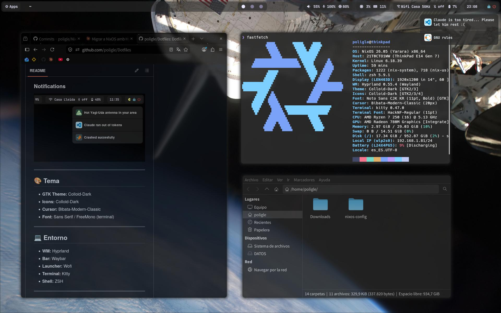
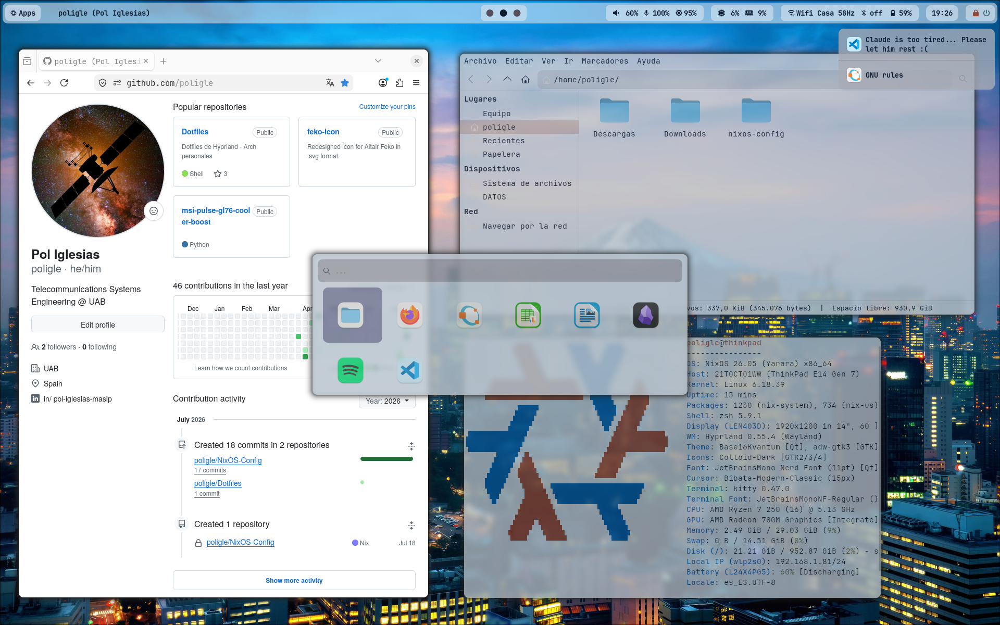
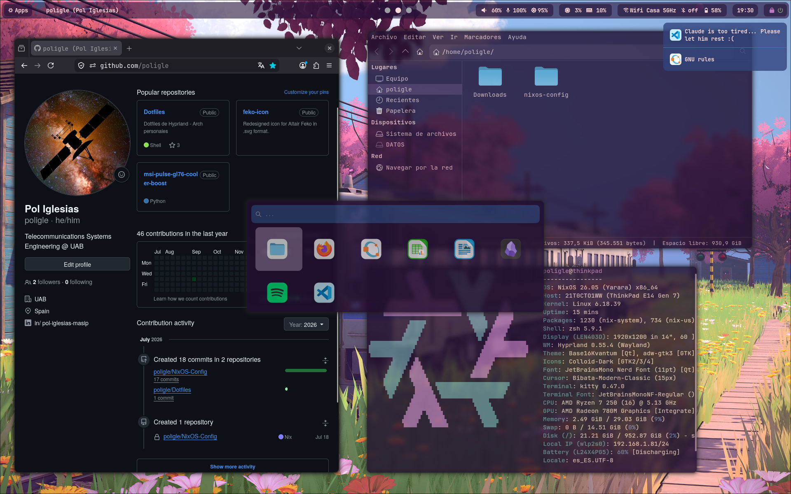

# nixos-config





Declarative NixOS configuration for `poligle@thinkpad`, based on Flakes, Home Manager and Stylix.
Desktop environment: **Hyprland** (configured natively in Nix using the Lua backend due to the recent update),
with the whole colour scheme generated from the current wallpaper.

---

## Overview

This repository holds the complete, reproducible configuration of my NixOS system.
Everything — packages, services, graphical environment, dotfiles, scripts and theming — is
defined declaratively, so the whole system can be rebuilt identically on any machine.

Migrated from Arch Linux + Hyprland (hyprlang) previous repository to NixOS + Hyprland (Lua).

---

## Structure

```
nixos-config/
├── flake.nix                 # Inputs (nixpkgs, home-manager, stylix) and outputs (hosts)
├── flake.lock                # Pinned exact versions (reproducibility)
├── home.nix                  # Home Manager index (imports home/*)
│
├── hosts/                    # Per-machine configuration
│   └── thinkpad/
│       ├── default.nix       # Imports modules + hostname + stateVersion
│       └── hardware-configuration.nix
│
├── modules/                  # Shared system modules (common across hosts)
│   ├── boot.nix              # systemd-boot (UEFI)
│   ├── plymouth.nix          # Boot splash, silent boot
│   ├── network.nix           # NetworkManager, Bluetooth
│   ├── locale.nix            # Timezone, language, keyboard
│   ├── audio.nix             # PipeWire
│   ├── hardware.nix          # Touchpad, fprintd, zram, graphics, micmute LED
│   ├── users.nix             # User and shell (zsh)
│   ├── packages.nix          # System packages, fonts, unfree
│   ├── hyprland.nix          # Hyprland compositor
│   ├── greetd.nix            # Display manager (greetd + tuigreet)
│   ├── desktop.nix           # Thunar, gvfs, tumbler
│   ├── services.nix          # SSH and other services
│   ├── stylix.nix            # Wallpaper, palette, fonts, cursor, opacity
│   └── nix.nix               # Flakes, garbage collection, store optimization
│
├── home/                     # User configuration (Home Manager)
│   ├── hyprland.nix          # Hyprland (Lua): binds, gestures, animations, rules
│   ├── waybar.nix            # Status bar (custom CSS driven by the Stylix palette)
│   ├── wofi.nix              # Launcher (custom CSS driven by the Stylix palette)
│   ├── kitty.nix             # Terminal
│   ├── hyprlock.nix          # Lock screen (password + fingerprint)
│   ├── hypridle.nix          # Idle daemon
│   ├── dunst.nix             # Notifications / OSD
│   ├── awww.nix              # Wallpaper daemon
│   ├── gtk.nix               # GTK settings and icon theme
│   ├── thunar.nix            # XFCE helper so Thunar opens kitty
│   ├── firefox.nix           # Firefox profile (required for Stylix theming)
│   ├── desktop-entries.nix   # Hides unwanted launcher entries
│   ├── zsh.nix               # Shell
│   ├── nvim.nix              # Editor
│   ├── vscode.nix            # Editor
│   ├── python.nix            # Python environment
│   ├── scripts.nix           # Own scripts, packaged
│   └── waybar-autohide.py    # Python auto-hide script for the bar
│
└── wallpapers/               # Wallpapers (versioned for cloning)
```

### Layered separation

- **`hosts/`** — What is specific to each machine (hardware, hostname).
- **`modules/`** — What is common to all machines (packages, services, environment).
- **`home/`** — The user configuration (declarative dotfiles).

Adding a new machine is just a matter of creating a `hosts/<name>/` that imports the
same shared modules plus its own `hardware-configuration.nix`.

---

## Theming

Colours are generated from the wallpaper by Stylix and applied system-wide: GTK, Qt,
kitty, dunst, hyprlock, Hyprland borders, VSCode, Plymouth and Firefox.

**`modules/stylix.nix` is the single source of truth.** The wallpaper is declared once
there and everything else references it — `awww.nix` reads `config.stylix.image` to set
the desktop background, and hyprlock gets its background from Stylix directly. Wallpaper,
lock screen and palette cannot drift apart by construction.

### Changing the theme

```nix
# modules/stylix.nix
image = ../wallpapers/some-other.jpg;
```

Then rebuild. A reboot is the simplest way to see everything applied at once, since
waybar is launched by Hyprland rather than systemd and won't reload on its own.

The generated palette can be inspected at `/etc/stylix/palette.html` before committing
to a wallpaper. More colourful images tend to produce better palettes.

### Exceptions

- **waybar** and **wofi** keep their own CSS (`stylix.targets.*.enable = false`), but
  their colours are pulled from `config.lib.stylix.colors`. This preserves the custom
  layout — rounded module groups, icon-only launcher grid — while still following the
  wallpaper.
- **Icons** stay on Colloid regardless of the palette (`stylix.iconTheme` is opt-in and
  left off).
- **Obsidian** is not themed: Stylix has no target for it.

---

## Daily usage

Rebuild the system after editing the configuration:

```bash
sudo nixos-rebuild switch --flake ~/nixos-config#<name>
```

Validate the configuration without building:

```bash
nix flake check
```

Build without activating (to test changes safely):

```bash
sudo nixos-rebuild build --flake ~/nixos-config#<name>
```

Update packages (equivalent to `pacman -Syu` from Arch):

```bash
nix flake update                                          # updates flake.lock
sudo nixos-rebuild switch --flake ~/nixos-config#thinkpad # applies
```

Manually clean up old generations:

```bash
sudo nix-collect-garbage --delete-older-than 7d
```

> Garbage collection also runs automatically on a weekly basis (see `modules/nix.nix`).

---

## Recovery

- **System won't boot:** pick an earlier generation from the boot menu (systemd-boot).
  It's a system-level restore point.
- **A configuration broke something:** roll the repository back to a previous commit
  with Git (`git log`, `git revert`, `git checkout`), fix it, and rebuild. Git versions
  the *code*; generations version the *system*.

---

## Cloning to a new machine

1. Install base NixOS and generate the new machine's hardware config:

   ```bash
   sudo nixos-generate-config --show-hardware-config > /tmp/hardware-configuration.nix
   ```

2. Clone this repository:

   ```bash
   git clone git@github.com:poligle/nixos-config
   cd nixos-config
   ```

3. Create the new host:

   ```bash
   mkdir -p hosts/<name>
   cp /tmp/hardware-configuration.nix hosts/<name>/
   cp hosts/thinkpad/default.nix hosts/<name>/default.nix
   # edit hosts/<name>/default.nix: adjust networking.hostName
   ```

4. Add the new configuration to `flake.nix`:

   ```nix
   nixosConfigurations.<name> = nixpkgs.lib.nixosSystem {
     system = "x86_64-linux";
     modules = [
       ./hosts/<name>/default.nix
       stylix.nixosModules.stylix
       home-manager.nixosModules.home-manager
       {
         home-manager.useGlobalPkgs = true;
         home-manager.useUserPackages = true;
         home-manager.backupFileExtension = "hm-bak";
         home-manager.users.poligle = import ./home.nix;
       }
     ];
   };
   ```

5. Build:

   ```bash
   git add .
   sudo nixos-rebuild switch --flake .#<name>
   ```

Local state is not part of the repository and has to be set up again on each machine:
user password (`passwd`), SSH keys, and fingerprint enrollment (`fprintd-enroll`).

---

## Technical details

- **Filesystem:** btrfs with subvolumes (`@`, `@home`, `@nix`, `@log`), zstd compression
  and `noatime`. Swap via zram.
- **Boot:** UEFI + systemd-boot, Plymouth splash with silent boot kernel parameters.
- **Hyprland in Lua:** since version 0.55, Hyprland recommends Lua configuration. The
  config is declared in Nix (`wayland.windowManager.hyprland.settings`) and Home Manager
  generates `hyprland.lua`. Configuration blocks that the Lua backend does not translate
  correctly (`hl.config`, `hl.monitor`, animations, gestures, rules) are defined via
  `extraConfig` using direct Lua syntax.
- **Own scripts:** packaged with `writeShellScriptBin` and their dependencies declared
  explicitly, for full reproducibility: `waybar-autohide`, `mic-led-sync`, `osd-volume`,
  `osd-brightness`.
- **Numerical computing:** GNU Octave. MATLAB is deliberately left out of the declarative
  config due to licensing and FHS requirements; if ever needed, it would be installed
  separately (e.g. via `buildFHSEnv` or `nix-ld`).

 ---

## Notes

Public repository: contains no secrets or credentials. User passwords are set with
`passwd`, and SSH keys and fingerprint data live outside the repository.
